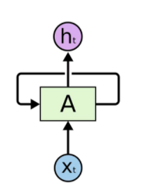
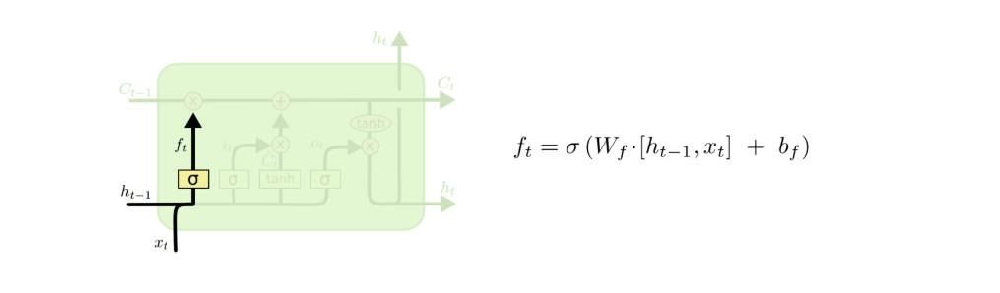
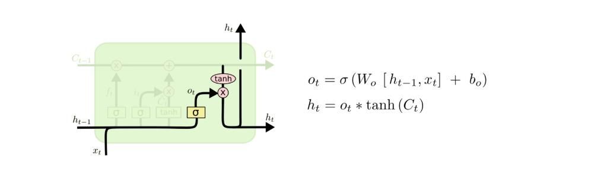
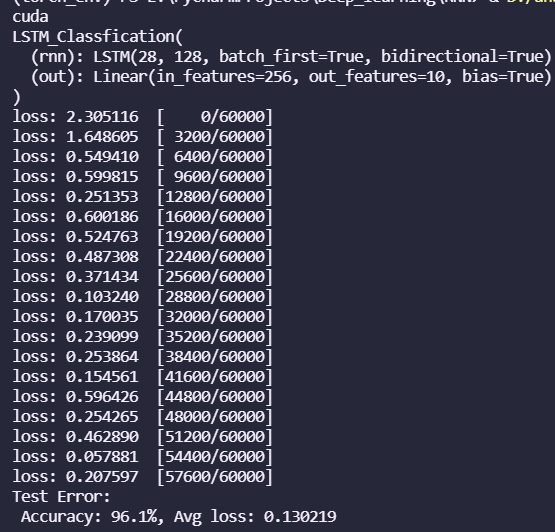

<<<<<<< HEAD
# LSTM

### 什么是LSTM？

RNN 会受到短时记忆的影响。如果一条序列足够长，那它们将很难将信息从较早的时间步传送到后面的时间步。




​							$$H^{(t)}=\sigma(W^{ht}\cdot X{(t)}+W^{hh}\cdot H^{(t-1)}+b_n) $$


LSTM 是**解决短时记忆**问题的解决方案，它们具有称为**“门”**的内部机制，可以调节信息流。

这些“**门**”可以知道序列中哪些重要的数据是需要**保留**，而哪些是要**删除**的。 随后，它可以沿着长链序列传递相关信息以进行预测，几乎所有基于循环神经网络的技术成果都是通过这两个网络实现的。 


### LSTM体系结构

LSTM被称为门结构：一些数学运算的组合，这些运算使信息流动或从计算图的那里保留下来。因此，它能够“决定”其长期和短期记忆，并输出对序列数据的可靠预测：


LSTM单元中的预测序列。注意，它不仅会传递预测值，而且还会传递一个c，c是长期记忆的代表

#### 遗忘门

遗忘门（forget gate）是输入信息与候选者一起操作的门，作为长期记忆。在输入、隐藏状态和偏差的第一个线性组合上，应用一个sigmoid函数：




sigmoid将遗忘门的输出“缩放”到0-1之间，然后，通过将其与候选者相乘，我们可以将其设置为0，表示长期记忆中的“遗忘”，或者将其设置为更大的数字，表示我们从长期记忆中记住的“多少”。

#### 输入门

输入门是将包含在输入和隐藏状态中的信息组合起来，然后与候选和部分候选c''u t一起操作的地方：


在这些操作中，决定了多少新信息将被引入到内存中，如何改变——这就是为什么我们使用tanh函数

（从-1到1）。我们将短期记忆和长期记忆中的部分候选组合起来，并将其设置为候选。


#### 输出门和隐藏状态（输出）

之后，我们可以收集o_t作为LSTM单元的输出门，然后将其乘以候选单元（长期存储器）的tanh，后者已经用正确的操作进行了更新。网络输出为h_t。


LSTM单元方程


​									$${f_t} = \sigma(U_fx_t+V_fh_{t-1}+b_f)$$

​									$$i_t = \sigma(U_ix_i+V_ih_{t-1}+b_i)$$

​									$$o_t = \sigma(U_ox_i+V_oh_{t-1}+b_0)$$

​									$$g_t = tanh(U_gx_t+V_gh_{t-1}+b_g)  等价于 \tilde{c_t}$$

​									$$c_t = f_t  \cdot c_{t-1} + i_t \cdot g_t $$

​									$$h_t = o_t \cdot tanh(c_t)$$

# BI-LSTM

双向LSTM的结构与双向RNN基本相同。但双向LSTM能够同时利用过去时刻和未来时刻的信息，会比单向LSTM的预测更加准确。 

               


#### 代码实现部分的一些方法详解：

#### 主要对里面的使用的方法进行一个单独的介绍

#####   hand_lstm.py:

```python
nn.Parameter()  
```

可以使用nn.Parameter()来转换一个固定的权重数值，使的其可以跟着网络训练一直调优下去，学习到一个最适合的权重值。

也就是说其作用是使得当前的参数可以被保存梯度

```python
torch.Tensor(2,1)

# 输出结果
tensor([[0.],
        [0.]])
```

生成一个 size 为(a,b) 的全0张量

当使用nn.Parameter()后，这个全0张量会被赋予一个随机值

```python
nn.Parameter(torch.Tensor(2，1))  

# 输出结果
Parameter containing:
tensor([[9.1477e-41],
        [1.0739e-05]], requires_grad=True)

# requires_grad=True 保留梯度信息
```

```markdown
stdv = 1.0 / math.sqrt(128)
```

​									$$stdv =  {1\over\sqrt{128}}$$


uniform_(a,b)  在a,b中间tensor从均匀分布中抽样数值进行填充。

```python
b = torch.randn(2,3)
# tensor([[ 0.7628, -1.6425, -1.4857],
#        [ 0.4624,  0.4417, -1.0390]])
b.uniform_(0, 1)
# tensor([[0.4614, 0.1125, 0.6703],
#         [0.1231, 0.2875, 0.3648]])
```

torch.zeros()  比较基础的，就是生成一个 全0的tensor

```python
torch.zeros(2,3)
# tensor([[0., 0., 0.],
#        [0., 0., 0.]])
```

unsqueeze()  增加一个维度

```python
c = torch.zeros(2,3)
c = c.unsqueeze(0)
# tensor([[[0., 0., 0.],
#          [0., 0., 0.]]])
c.size()
# torch.Size([1, 2, 3])
```

cat()  按第N维进行拼接  将这个list 转化为tensor结构 

```python
"""
l1:
[tensor([[[ 0.4480,  0.4832, -0.1113],
          [ 1.0129, -0.6316,  0.2096]]]),
 tensor([[[ 1.9288,  0.8110,  0.5142],
          [-0.2250,  2.0976,  0.0366]]])]
"""
torch.cat(l1,dim=0)

"""
tensor([[[ 0.4480,  0.4832, -0.1113],
         [ 1.0129, -0.6316,  0.2096]],

        [[ 1.9288,  0.8110,  0.5142],
         [-0.2250,  2.0976,  0.0366]]])
"""

l1.size()

# torch.Size([2, 2, 3])
```

transpose(input, dim0, dim1)   

- input (Tensor) – 输入张量，必填
- dim0 (int) – 转置的第一维，默认0，可选
- dim1 (int) – 转置的第二维，默认1，可选

```python
"""
tensor([[[ 1.0085,  1.3747, -1.2875,  0.8424],
         [-0.2851, -1.5225, -1.1119, -1.5243],
         [-0.4864,  0.8463, -0.5516,  0.2596]],

        [[-0.8208, -1.9864, -1.3729, -0.5153],
         [-0.7217,  0.5975,  1.1512,  1.1755],
         [ 0.6672, -1.9025, -0.6683, -0.4970]]])
"""
l1.transpose(0,1)


"""tensor([[[ 1.0085,  1.3747, -1.2875,  0.8424],
         [-0.8208, -1.9864, -1.3729, -0.5153]],

        [[-0.2851, -1.5225, -1.1119, -1.5243],
         [-0.7217,  0.5975,  1.1512,  1.1755]],

        [[-0.4864,  0.8463, -0.5516,  0.2596],
         [ 0.6672, -1.9025, -0.6683, -0.4970]]])
"""
```

##### lstm_train.py

1.model.train() 和 model.eval() 

简单来说，

 是设置了训练或者测试模式，定义模型是否需要学习。对部分层有影响，如Dropout和BN。具体影响如下：

​	1.Dropout: 训练过程中，为防止模型过拟合，增加其泛化性，会随机屏蔽掉一些神经元，相当于输入每次走过不同的“模型”。测试模式时，所有神经元共同作用，类似于boosting。

​	2.BN: 训练过程中，模型每次处理一个minibatch数据，BN根据一个minibatch来计算mean和std后做归一化处理，这也是为什么模型的性能和minibatch的大小关系很大,测试时，BN会利用训练时得到的参数来处理测试数据。如果不设置model.eval()，输入单张图像，会报错。

​         3.model. train()和model. eval()可以看做是对这种训练和测试需要联动的模块进行一个统一的设置。当你在写model的时候，你写的是测试和训练通用的model，这个时候，就是通过model. train()和model. eval()来来设置model的测试阶段和训练阶段。这样在用需要训练和测试联动的模块的时候，就不用再专门写一个训练的model和一个测试的model了

 2.Variable ()

tensor不能反向传播，variable可以反向传播。

Variable计算时，它会逐渐地生成计算图。这个图就是将所有的计算节点都连接起来，最后进行误差反向传递的时候，一次性将所有Variable里面的梯度都计算出来，而tensor就没有这个能力。

 

运行结果：


BI-LSTM：



Hand-LSTM：


Hand-BI-LSTM：


